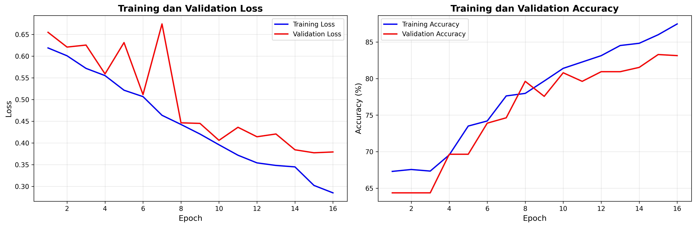
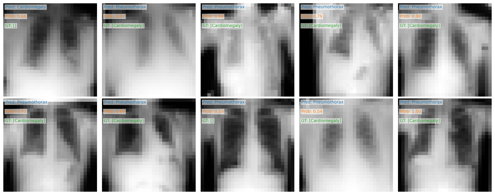

# Laporan Eksperimen ChestMNIST

## 1. Perubahan yang Dilakukan
- Mengganti model dari `SimpleCNN` → `AlexNet` (adapted untuk gambar 28x28 grayscale)
- Menambahkan device-aware training (`cuda`)
- Loss function otomatis: BCEWithLogitsLoss (binary) / CrossEntropyLoss (multi-class)
- Label preprocessing disesuaikan dengan tipe loss
- Menyimpan model terbaik (`best_model.pth`)
- Perbaikan dummy test input dan pengecekan arsitektur model

## 2. Parameter Training
- Epochs: 25
- Batch size: 32
- Learning rate: 0.0003
- Optimizer: Adam

## 3. Hasil Training
- Model: AlexNet (adapted)
- Best validation accuracy: **83.28%**
- File hasil:
  - `training_history.png` → grafik loss dan akurasi
  - `val_predictions.png` → prediksi pada 10 gambar random dari validation set

## 4. Kesimpulan Singkat
- AlexNet yang diadaptasi lebih kompleks dari SimpleCNN, memungkinkan model belajar fitur lebih baik.
- Adaptasi arsitektur dan preprocessing label membuat model kompatibel untuk binary dan multi-class.
- Penggunaan device-aware training mempercepat proses training jika GPU tersedia.
- Model terbaik disimpan otomatis untuk evaluasi lebih lanjut.
- Akurasi validasi 83.28% menunjukkan model cukup baik untuk dataset ChestMNIST, namun masih ada ruang untuk perbaikan.

## 5. Visualisasi

